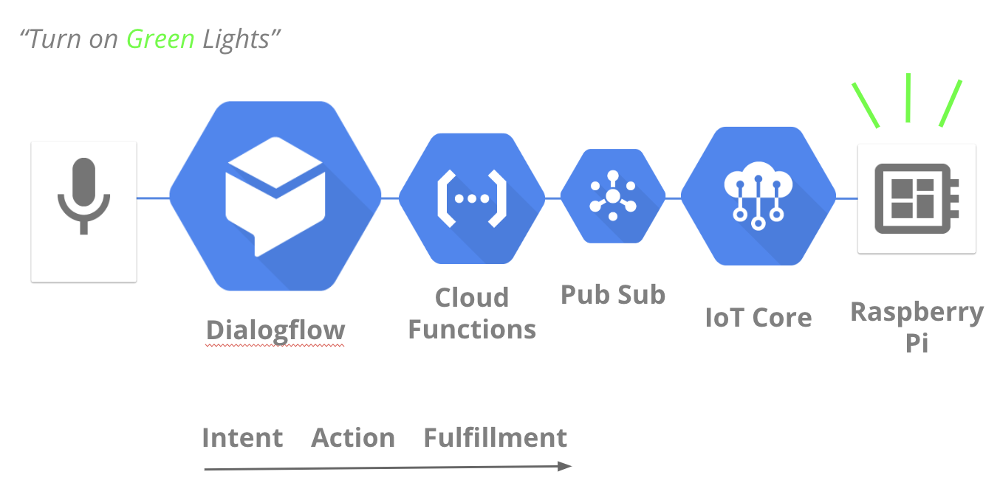
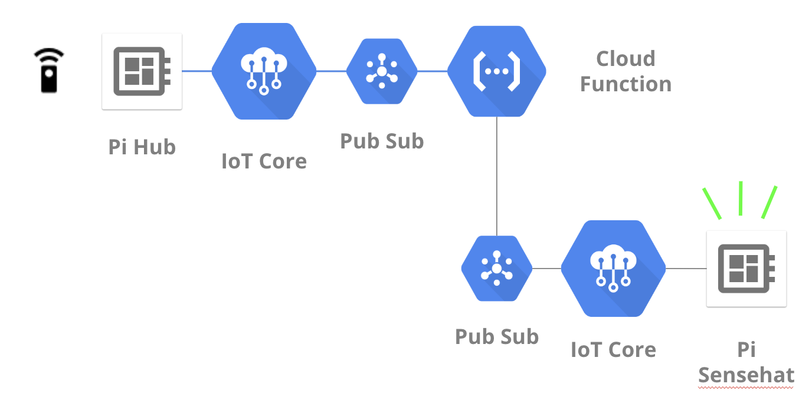
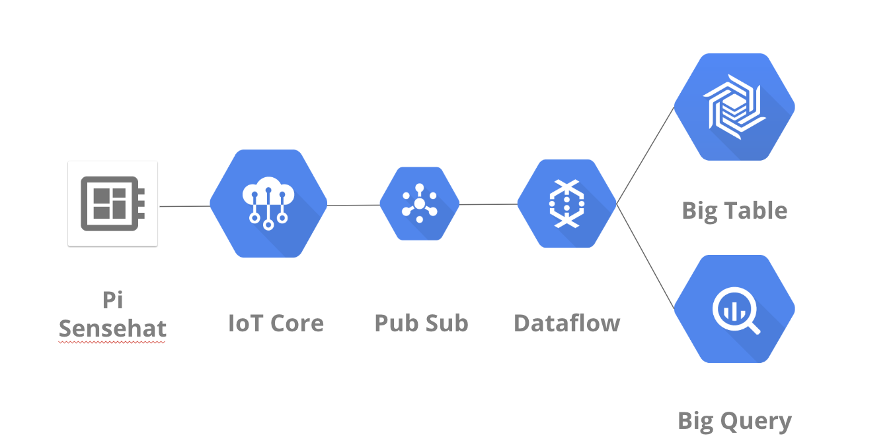

# IOT demo

## Setup
I have 2 Raspberry Pis:
- Sensehat : which pushes sensory data to Pub/Sub -> DataFlow -> BigTable/BigQuery. It can also receive device config updates to activate the light panel.
- Hub : Acts as a remote IoT device hub.  I've connected a radio wireless receiver to the Pi that receives a switch on/off signal from a remote switch/transmitter.

Both Pis are registered securely with IoT Core and have Pub/Sub topics for bidirectional communication.
Setup is out of scope of this repo. See https://codelabs.developers.google.com/codelabs/iotcore-heartrate/#0 for inspiration.

I've also incorporated Dialogflow to command the Sensehat light panel via voice.

## 3 Use Cases
### Light Up with Voice

### Switch Lights On/Of via an IoT Hub

### Capture IoT Sensor Data

## Code Snippets
- sensehat.py : python script to run on the sensehat raspberry pi
Publishes sensor data and processes light instructions received from IoT Core.

- hub_1_0.py : python script to run on the hub Pi
Handles switch on/off clicks and publish events to IoT Core to turn on the lights on the sensehat Pi

- fulfillment-cloud-function : cloud function to process dialog flow event and send to sensehat

- hub-cloud-function : cloud function to process hub event and send command to sensehat

- dialogflow : export of Intents and Entities to command the lights on the Sensehat PI.

## Disclaimer
* This is not an officially supported Google repo/product.
* This is a 101 intro to concepts allowing me to run demos.
* It is not a statement of best practices nor meant for production usage.
* Don't be that cut and paste coder!
